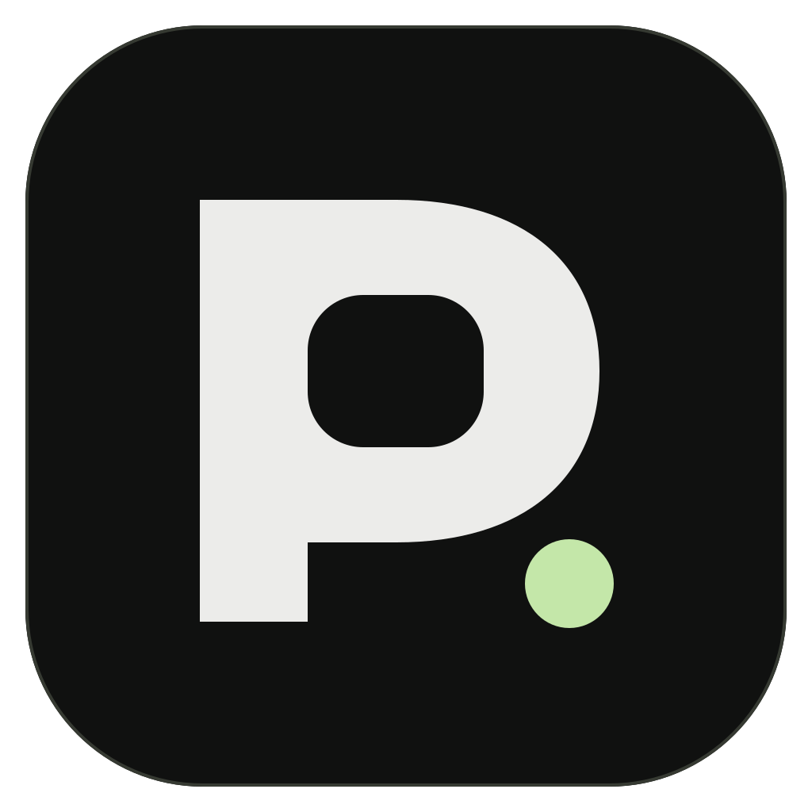
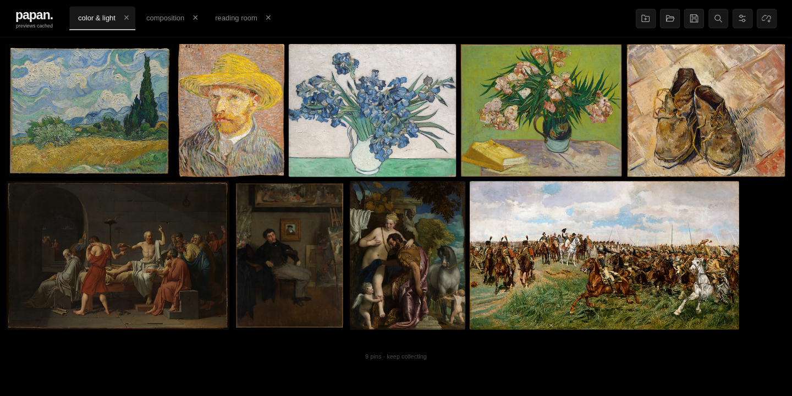
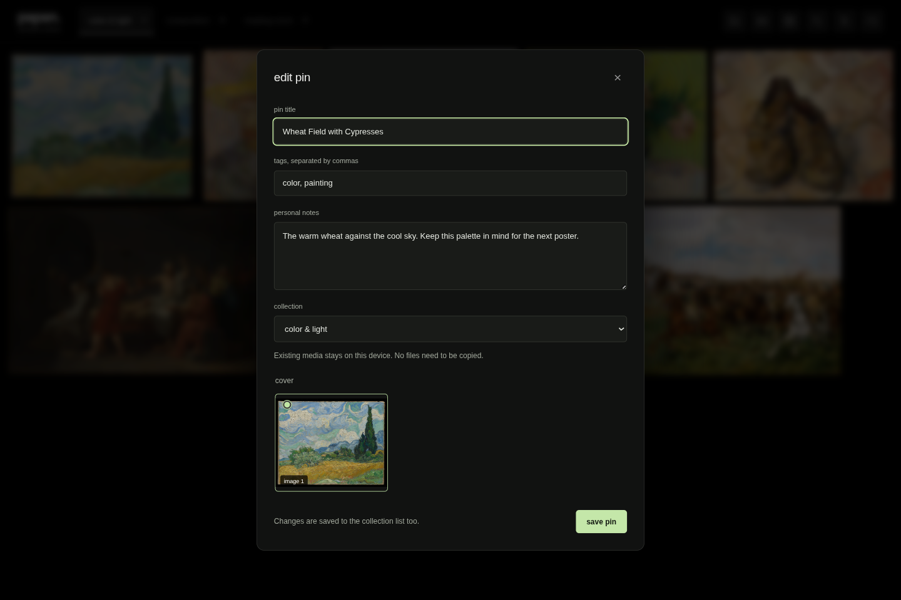
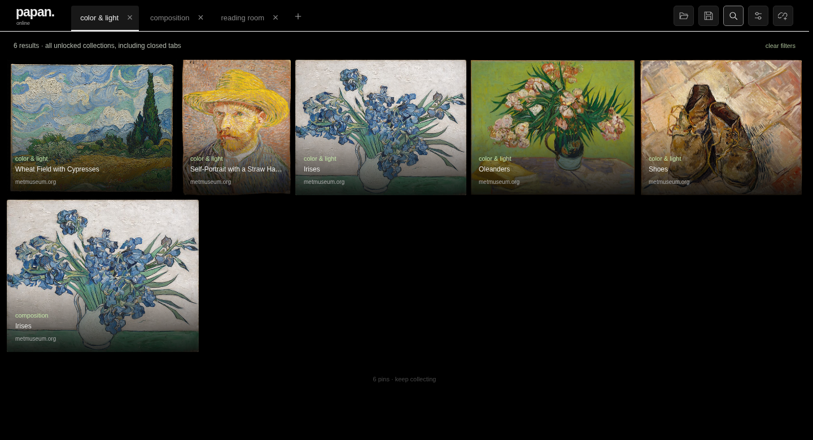

# Papan

**A personal board for the things you find on the web.**

Good references disappear into browser tabs and download folders. Papan keeps images, videos, and readable articles together in a quiet desktop canvas. Paste a link, choose what to keep, and collect it locally. No account or cloud service required.

[Download Papan](https://github.com/chelij/papan/releases/latest) · [Android companion](https://github.com/chelij/papan-android) · [Download APK](https://github.com/chelij/papan-android/releases/latest) · [User guide](docs/usage.md) · [Changelog](CHANGELOG.md) · [Architecture](docs/architecture.md) · [Ecosystem and compatibility](docs/ecosystem.md)



## What you can do

- **Paste to collect.** Choose individual media, a cover, and a destination collection. Public X posts, YouTube videos, Instagram posts, direct media, and accessible articles use dedicated extraction paths.
- **Share from Android.** Pair [Papan for Android](https://github.com/chelij/papan-android) over your local network and share links into a chosen collection. Undelivered links stay queued on the phone. [Setup, APK builds, and iPhone Shortcut preparation](docs/mobile-sharing.md).
- **Browse visually.** Responsive columns align every row. Preview frames use the average media proportions of the collection. Choose saved items for board previews and set separate start/end ranges for each video. All previews share a stable frame; visible videos play silently.
- **Make it yours.** Rename pins, change covers, move them between collections, and add tags and personal notes. Drag pins onto collection tabs, create destinations while editing, and undo removals after restarting.
- **Extract poses locally.** Turn saved videos into attached DWPose control videos, clean up people/joint confidence, and reuse them in ComfyUI. The optional CPU tools download only after first-use confirmation.
- **Follow background work.** Activity combines downloads, pose extraction, and incoming phone shares while you keep collecting.
- **Find it again.** Search titles, notes, tags, and saved text across unlocked collections, including closed tabs. Narrow results by media type, source, and tag.
- **Use pins in ComfyUI.** The [Papan ComfyUI extension](https://github.com/chelij/comfyui-papan) opens board files and connects image/video references from one loader node.
- **Keep collecting while files save.** A background queue shows progress, cancellation, failures, and retry. Successful tasks disappear automatically. Open temporary tabs with Ctrl/Cmd+T; collections are saved only when you add a link.
- **Choose what stays on disk.** Cache smaller previews in online mode or download originals in offline mode. Pins open in Papan first, with their original page available from the viewer.
- **Protect a collection.** Encrypt its contents and saved media with a password. Lock it from the toolbar; protected saves and portable exports stay encrypted.
- **Take a collection with you.** Save a lightweight `.papan` list, or export a `.papan.zip` with its local media and metadata for another device.

<details>
<summary>See pin editing and library-wide search</summary>





</details>

Screenshots use public-domain artwork from The Met. [Credits and reproducible demo](docs/demo/credits.md). The installed app starts empty; no sample collection is bundled.

## Try it

Download the archive for your operating system from [Releases](https://github.com/chelij/papan/releases/latest), extract it, and launch `papan` on Linux, `papan.exe` on Windows, or `Papan.app` on macOS. Keep the extracted folder together. Media tools are included; Python is only needed for development.

| Platform | Verification |
| --- | --- |
| [Linux x64](https://github.com/chelij/papan/releases/download/v0.3.0/Papan-0.3.0-linux-x64.tar.gz) | Release checks target Ubuntu 22.04. |
| [Windows x64](https://github.com/chelij/papan/releases/download/v0.3.0/Papan-0.3.0-win32-x64.zip) | Release checks use the native Windows runner. |
| [macOS Apple silicon](https://github.com/chelij/papan/releases/download/v0.3.0/Papan-0.3.0-darwin-arm64.tar.gz) | Release checks use the native macOS ARM64 runner. |

The [board refresh fix run](https://github.com/chelij/papan/actions/runs/37505303426) passed native source and packaged-app checks on all three platforms. The [release workflow](.github/workflows/desktop.yml) gates every new desktop package on native source and packaged-app checks. This is an early release. Desktop builds are unsigned; macOS notarization and a Windows signing certificate are not configured. A successful runner check is not a claim of testing every desktop or OS version. [Check results and limits](docs/verification.md).

## Run from source

Install Node.js **24.15+** and Python **3.11+**, then:

```sh
git clone https://github.com/chelij/papan.git
cd papan
npm ci
npm run setup
npm start
```

`setup` creates a project-local Python environment and installs the pinned media tools. No API keys or browser cookies are needed. [Build packages and run checks](docs/development.md).

## Under the hood

Electron with a sandboxed vanilla JavaScript renderer; a small IPC surface; atomic local JSON writes with previous snapshots; a durable download queue; Sharp image previews; and a separate Python extraction helper. Portable imports validate archive paths and sizes before committing a new collection.

The interesting tradeoffs are local ownership, recoverable writes, responsive browsing during media work, and predictable mixed-media layout. [Read the architecture and failure handling](docs/architecture.md).

## Limits and license

Papan collects individual posts and pages. It tries public extraction first, then automatically finds an existing desktop browser login for X, Instagram, or YouTube if needed. You can disable browser sessions in Privacy settings; cookies are never saved in Papan or shared with a phone. Some platforms still block extraction, and a successful preview does not guarantee a download. Profiles, feeds, live streams, and cloud sync are outside the current scope. Saved previews can be viewed without the source, but silent video previews are not original downloads.

Desktop code: **[GPL-3.0-or-later](LICENSE)**. The separate extraction helper is **[GPL-2.0-only](worker/LICENSE)**. Copyleft dependencies make an MIT-only distribution inappropriate for this build. Dependency licenses, source archives, and notices are described in [THIRD-PARTY.md](THIRD-PARTY.md).
