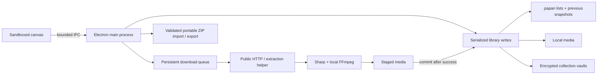

# Architecture

Papan stores a personal media library on one device. It uses plain JavaScript, Electron, JSON metadata, filesystem media, and small Python subprocesses. There is no hosted application server or account database; an optional local HTTP receiver accepts paired phone links.

## Boundaries

- `src/renderer/` owns the canvas, adaptive layout, live settings previews, accessible dialogs, search, and visible media playback. It has no Node access.
- `src/preload.cjs` exposes named operations. `src/main.js` accepts calls only from the app's main frame and owns files, dialogs, navigation, subprocesses, and commits.
- `src/library.js` serializes atomic metadata writes and validates collection settings and pin details. `src/collection-files.js` handles revision-checked saved lists and media references.
- `src/protection.js` manages collection locks and encryption transactions. `src/vault.js` stores authenticated metadata and media chunks; `src/file-response.js` serves byte ranges for ordinary and encrypted playback. [Format and recovery design](encryption.md).
- `src/download-queue.js` persists tasks and runs one media job at a time. Network work happens outside the library write queue, so unrelated edits remain responsive.
- `src/phone-receiver.js` owns an opt-in LAN HTTP listener, one-use pairing, hashed device keys, and an atomic raw-URL inbox with durable receipts. `src/phone-save.js` uses the existing inspector/materializer and stable pin/source checks to save accepted links. Protection transactions recode inbox entries alongside download tasks. The native Java companion in [papan-android](https://github.com/chelij/papan-android) persists unacknowledged links and schedules retry via Android JobScheduler. [Protocol and transport limits](mobile-sharing.md).
- `src/media.js` routes URLs, validates and bounds downloads, extracts articles, and prepares previews. `worker/extract.py` runs gallery-dl, yt-dlp, and Instaloader as a separate executable.
- `src/page-browser.js` renders general JavaScript pages in a hidden, sandboxed Electron window with no preload or Node access. Each inspection uses a separate memory-only session, denies permissions/popups/downloads and non-web requests, and copies the rendered DOM from an isolated world. Discovery waits for media and network settling for up to eight seconds after loading, with a twenty-second rendering limit and cancellation cleanup. After anonymous discovery fails, the Privacy preference enables a retry seeded with site-scoped browser cookies from the helper. Cookies never reach the app renderer and the inspection session is cleared on completion or cancellation. Desktop and phone saves use the same inspector; public direct media and static pages keep their existing path. Browser storage/fingerprint, click-driven media extraction and blob-stream downloads are not copied or supported.
- `src/pose.js` downloads and verifies the optional platform runtime and immutable DWPose/YOLOX ONNX weights only after extraction is confirmed. The base app includes a runtime URL/size/hash manifest and license/source notices, with no pose executable. Dependency inspection reads the cache without creating files or fetching anything. `worker/pose.py` runs as a separate local CPU process; rtmlib inference and FFmpeg encoding stream frames with bounded memory, and cancellation stops its process group. Downloads use private temporary files, exact sizes, and SHA-256 verification before rename; only verified runtime bytes become executable. `src/pose-pin.js` commits a `kind: video` item with `poseFor` pointing to the selected original video, retaining source pin identity and cover. The renderer excludes attachments from previews, autoplay, album navigation, sizing, and cover editing, and plays them only through **view pose**. For unlocked protected sources, authenticated original media streams into a mode-0600 file in private staging; the worker receives only its filename. The existing protection transaction encrypts the attachment before commit and cleans up plaintext. Pose work uses the existing pin queue kind and encrypted task codec; old port fields are ignored and `posePinId` remains a retry bridge for unfinished earlier preview tasks, including adoption of a matching already-committed result without another extraction. Remove this bridge when those local-development queues are no longer supported. Local-only attachments are preserved during preview repair and collection conversion. Media cleanup tracks every item's owned folder, including removal history and the recovery snapshot.
- `src/portable.js` and `worker/archive.py` export/import a collection with its media. Python's standard ZIP library avoids another native archive dependency.

## Commit after the work succeeds

A save snapshots the chosen media and destination, downloads into a unique staging folder, builds previews, then rechecks the destination and duplicates inside a short library transaction. A failed or cancelled save cleans its new files. Editing a pin into a collection that needs originals follows the same path.

The renderer's Activity panel combines the latest download-queue and phone-inbox snapshots without changing either queue, its persisted format, or receiver protocol v1. Completed downloads and saved phone shares are omitted; phone receipts remain in receiver settings. Actions use their original queue APIs. Card pose controls depend on a read-only check of installed runtime/model checksums and follow the displayed original video, including while an album's next slide is loading. Attachment updates refresh those controls while retaining decoded previews and playback state.

Collection conversion merges only new media fields, preserving title and note edits made during the download. If the collection settings changed or new pins arrived, conversion asks for retry instead of committing an incomplete offline collection.

The queue records lifecycle transitions and publishes stage/item progress. It runs serially to bound CPU, disk, and network load. Interrupted tasks require an explicit retry after restart. Network URLs can expire, so retries sometimes require inspecting the source again. This is durable task recovery, not a guarantee that an upstream side effect runs exactly once.

## Local ownership and failure handling

The primary metadata file is written to a temporary file and renamed. The previous snapshot remains available. Saved `.papan` lists have revision IDs to detect external edits and their own previous copies. Moves affecting two list destinations restore earlier writes when a later write fails. Multi-file updates are not a filesystem transaction across a power loss; previous copies provide a recovery path.

Deletion keeps the last 20 removal records, including media references. Garbage collection preserves active pins, saved-list references, removal history, and the prior metadata snapshot. This favors recoverability over aggressively reclaiming storage.

New tabs live only in renderer memory until the first confirmed link save creates a collection. Clearing recent history changes visibility metadata; the All collections view still exposes saved collections. Protected collections start locked, and their pins and media stay out of the renderer until password authentication succeeds.

List saves deliberately reference existing media. Portable export is a different operation: metadata and media are packaged into a self-contained snapshot. Imports validate every entry, extract into staging, discard saved destination fields, assign new IDs, and commit an independent collection. The source archive and existing library are left intact.

## Predictable media layout

The board uses a column count derived from density and viewport width. Every row shares the same column widths and frame height, including a partial last row. Collection frames use the arithmetic mean of all known image/video width-to-height ratios in the collection, excluding text and missing dimensions. Filtering and progressive rendering do not limit that calculation to visible pins. All-collection search uses the accessible library's mean; square frames use 1:1. Ratios are sorted before summing so reordering pins does not introduce floating-point changes in the layout. Missing dimensions update the mean when media loads. Board media fills its frame; the viewer retains the full media. Drag previews use the same geometry as the final layout.

## Deliberate limits

Papan does not synchronize multiple writers or guarantee extraction from every URL. `browser-session.json` stores only an app-wide automatic/off preference. After public extraction or webpage discovery fails, the helper uses the native browser-cookie reader with a domain filter and skips expired cookies. Known extractors recognize their login cookies; general pages use the first browser with host-matching cookies. The `browser-cookies` helper action returns scoped cookie data only to the main process for temporary rendering or downloading. The existing `tough-cookie` dependency is declared directly and provides private/public suffix boundaries and a memory cookie jar; host-only cookies stay host-only, and downloads recalculate host/path/Secure matches on every redirect. The native reader omits HttpOnly/SameSite metadata, so copied webpage cookies are HTTP-only and use Chromium's default SameSite policy. Sites requiring JavaScript cookie access may fail; revisit this restriction when the upstream reader preserves these attributes. Cookies are never retained or exported by Papan. The native reader can make a temporary database copy when direct access fails; it removes that copy after reading. Collection files, pins, queues, and phone responses never receive cookie values. Search is in-memory and suited to a personal library; very large libraries may eventually need an indexed store. The renderer loads pins progressively, but metadata remains a single JSON document. Package files remain unpacked because native helpers cannot execute inside Electron ASAR.

Tests use temporary profiles and a local HTTP fixture. They exercise actual IPC, saved files, renderer interaction, cancellation, failure recovery, and a fresh-profile portable import after source deletion. [Verification details](verification.md).
