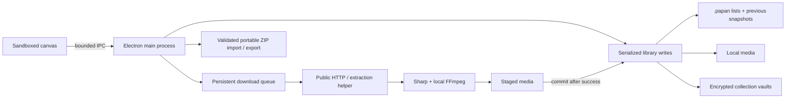

# Architecture

Papan stores a personal media library on one device. It uses plain JavaScript, Electron, JSON metadata, filesystem media, and small Python subprocesses. There is no application server or account database.

## Boundaries

- `src/renderer/` owns the canvas, adaptive layout, live settings previews, accessible dialogs, search, and visible media playback. It has no Node access.
- `src/preload.cjs` exposes named operations. `src/main.js` accepts calls only from the app's main frame and owns files, dialogs, navigation, subprocesses, and commits.
- `src/library.js` serializes atomic metadata writes and validates collection settings and pin details. `src/collection-files.js` handles revision-checked saved lists and media references.
- `src/protection.js` manages collection locks and encryption transactions. `src/vault.js` stores authenticated metadata and media chunks; `src/file-response.js` serves byte ranges for ordinary and encrypted playback. [Format and recovery design](encryption.md).
- `src/download-queue.js` persists tasks and runs one media job at a time. Network work happens outside the library write queue, so unrelated edits remain responsive.
- `src/media.js` routes URLs, validates and bounds downloads, extracts articles, and prepares previews. `worker/extract.py` runs gallery-dl, yt-dlp, and Instaloader as a separate executable.
- `src/portable.js` and `worker/archive.py` export/import a collection with its media. Python's standard ZIP library avoids another native archive dependency.

## Commit after the work succeeds

A save snapshots the chosen media and destination, downloads into a unique staging folder, builds previews, then rechecks the destination and duplicates inside a short library transaction. A failed or cancelled save cleans its new files. Editing a pin into a collection that needs originals follows the same path.

Collection conversion merges only new media fields, preserving title and note edits made during the download. If the collection settings changed or new pins arrived, conversion asks for retry instead of committing an incomplete offline collection.

The queue records lifecycle transitions and publishes stage/item progress. It runs serially to bound CPU, disk, and network load. Interrupted tasks require an explicit retry after restart. Network URLs can expire, so retries sometimes require inspecting the source again. This is durable task recovery, not a guarantee that an upstream side effect runs exactly once.

## Local ownership and failure handling

The primary metadata file is written to a temporary file and renamed. The previous snapshot remains available. Saved `.papan` lists have revision IDs to detect external edits and their own previous copies. Moves affecting two list destinations restore earlier writes when a later write fails. Multi-file updates are not a filesystem transaction across a power loss; previous copies provide a recovery path.

Deletion keeps the last 20 removal records, including media references. Garbage collection preserves active pins, saved-list references, removal history, and the prior metadata snapshot. This favors recoverability over aggressively reclaiming storage.

New tabs live only in renderer memory until the first confirmed link save creates a collection. Clearing recent history changes visibility metadata; the All collections view still exposes saved collections. Protected collections start locked, and their pins and media stay out of the renderer until password authentication succeeds.

List saves deliberately reference existing media. Portable export is a different operation: metadata and media are packaged into a self-contained snapshot. Imports validate every entry, extract into staging, discard saved destination fields, assign new IDs, and commit an independent collection. The source archive and existing library are left intact.

## Predictable media layout

The row algorithm fills available width using each pin's aspect ratio and a target height derived from density. A final incomplete row stays near the target height. Albums use the median ratio in logarithmic space, which treats portrait/landscape ties symmetrically and keeps the frame fixed while slides change. Drag previews use the same geometry as the final layout.

## Deliberate limits

Papan does not synchronize multiple writers, import browser credentials, or guarantee extraction from every public URL. Search is in-memory and suited to a personal library; very large libraries may eventually need an indexed store. The renderer loads pins progressively, but metadata remains a single JSON document. Package files remain unpacked because native helpers cannot execute inside Electron ASAR.

Tests use temporary profiles and a local HTTP fixture. They exercise actual IPC, saved files, renderer interaction, cancellation, failure recovery, and a fresh-profile portable import after source deletion. [Verification details](verification.md).
